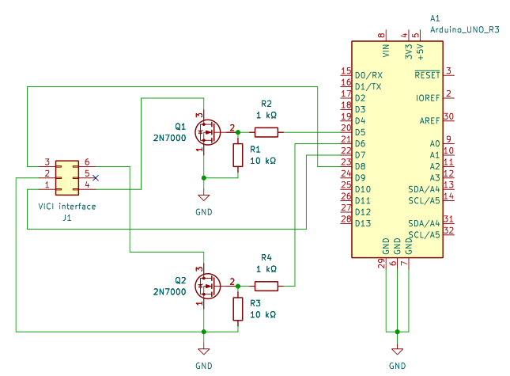
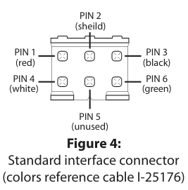

# MOLTECH-VICI-TTL-control: TTL controller for VICI valve actuator

This is an Arduino Uno R3-based controller for the VICI valve actuator, enabling direct switching of the valve via the TTL standard interface.

*under development*

This section of the repository *only* contains the hardware design and the Arduino firmware of MOLTECH-VICI-TTL-control. The Python module for communicating with the device is located in [`MANBAMM-control/python-src`](https://github.com/mhvwerts/MANBAMM-control/tree/main/python-src).

## Arduino firmware

The [firmware](https://github.com/mhvwerts/MANBAMM-control/tree/main/MOLTECH-VICI-TTL-control/VICI_TTL_firmware) is very basic, just communicating over a 9600 baud serial-to-USB connection, with simple instructions and replies. The intelligent handling of the valve switching and monitoring is done in the corresponding Python communications module. 

## Hardware

### Arduino Uno R3 extension board

The inputs on the VICI valve interface have an internal pull-up resistor, and valve switching occurs upon pulling down, for at least 20 ms, the input corresponding to the desired valve position. A specific inteface circuit based on the 2N7000 is used here to reliably pull down the VICI input, without any spurious valve switching upon powering on or off the Arduino board. The circuit was tested to work reliably and will not unexpectedly switch the valve when powering up or down. 

### Connector

The controller should be connected to the 6-pin "standard interface" connector on the back of the VICI valve enclosure.

**Figure.** VICI actuator standard interface connector pin-out

The functions of the pins change slightly depending on the operating mode of the valve actuator. 

**WARNING!** The current controller is designed for operation with the "Two Position Mode" only!

#### Two Position Mode Pin Assignments

| Pin # | Function         |
|-------|------------------|
| 1     | A output (3.3 VDC)|
| 2     | Common           |
| 3     | B output (3.3 VDC)|
| 4     | A contact        |
| 5     | Unused           |
| 6     | B contact        |

#### Multiposition Mode Pin Assignments

  Pin # | Function         |
 |-------|------------------|
 | 1     | Motor Run output |
 | 2     | Common           |
 | 3     | Home output      |
 | 4     | Home             |
 | 5     | Unused           |
 | 6     | Step             |

