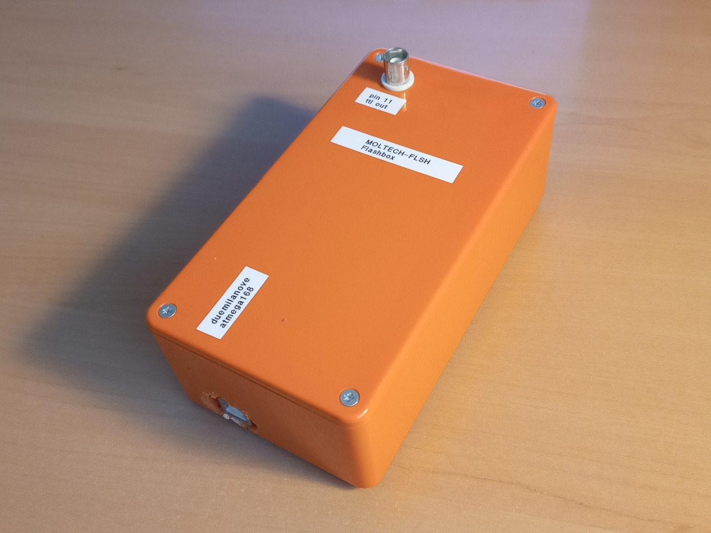

# MOLTECH-FLSH Flashbox

*by Martinus Werts*

*MOLTECH-Anjou, CNRS, Université d'Angers*

The MOLTECH-FLSH Flashbox is a small USB-powered electronics box for generating precisely timed trigger and strobe TTL pulses in long-afterglow ('long-lifetime') photoluminescence ('phosphorescence') experiments (from 5 µs up to many seconds). The pulse timings are set via the USB serial connection of the Arduino. The pulse trains are essentially jitter-free down to a microsecond or so, thanks to tight coding.

This section of the repository contains the hardware description of the MOLTECH-FLSH and the Arduino firmware. The host terminal software (Python programs running on the lab PC) can be found in  [`MANBAMM-control/python-src`](https://github.com/mhvwerts/MANBAMM-control/tree/main/python-src), together with the control software for other lab devices (*e.g.*, syringe pumps, fluidic valves, flowmeters).

## Hardware

In its present incarnation, the box is based on a recycled, ancient Arduino Duemilanove board (ATmega168) with the output pin (Arduino Pin 11, ATmega PB3) directly connected to a BNC terminal, without buffer or protection. The housing is a nice orange box. Other standard 5V Arduino boards (UNO and other ATmega328p boards) can be used without modification.

## Firmware

`firmware_flashbox_vX_X.ino` contains the current Arduino firmware. On one side, it takes care of switching the TTL outputs to generate the pulse sequences. On the other side, it interacts with the host terminal via a (USB) serial connection.

The firmware code does not use the Arduino routines, but is vanilla AVR with direct manipulation of the ATmega registers, enabling very tight control of the timing and microsecond resolution. The code can still be used with the standard Arduino IDE for programming and uploading to the board.

## USB serial communication protocol

The protocol is minimalist, and uses ASCII text. Pending more documentation, the protocol can be easily deduced from the firmware source code, and the Python scripts. The latter can be found in  [`MANBAMM-control/python-src`](https://github.com/mhvwerts/MANBAMM-control/tree/main/python-src).

