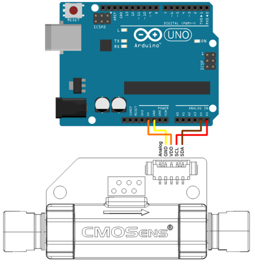

# MOLTECH-FSS Flow Sensor System

The MOLTECH-FSS Flow Sensor System enables recording of microfluidic flow rates through capillaries, using USB-connected hardware modules. At the heart of these modules there is a Sensirion liquid flow sensor (LG16-xxxxD family), which is managed by an Arduino-compatible microcontroller, which communicates with a host terminal (typically, a lab PC) through a USB serial connection.

This section of the repository contains the hardware description of the MOLTECH-FSS and the Arduino firmware. The host terminal software (Python programs running on the lab PC) can be found in `python-src` together with the control software for other lab devices (*e.g.*, syringe pumps, fluidic valves).

## Hardware

The Sensirion LG16-xxxxD modules are easily connected to an Arduino board for communication via an I2C bus. Here's the configuration for a standard Arduino UNO board (information provided by Sensirion).

Apparently, it is not necessary to add separate external pull-up resistors to the circuit. The sensor can be connected directly to the Arduino I/O pins.

Further information can be found in the [Sensirion LG16-xxxxD datasheet](https://github.com/mhvwerts/MANBAMM-control/blob/main/MOLTECH-flow-sensor-system/res/Sensirion_Liquid_Flow_Meters_LG16_xxxxD_Datasheet.pdf), of which we keep a copy in this repository.

## Firmware

`firmware_flowsensors_vX_X.ino` contains the current Arduino firmware. On one side, it takes care of the I2C communication with the Sensirion SF04 chip in the LG16-xxxxD series sensors. On the other side, it interacts with the host terminal via a (USB) serial connection.

More information and Arduino code for low-level communication with the Sensirion liquid flow sensors can be found at https://github.com/Sensirion/arduino-liquid-flow-snippets

## USB serial communication protocol

The protocol is very simple, and uses ASCII text. Numbers are given in ASCII decimal form. Each text block is terminated with a `!`, both on the terminal side and on the sensor module side.

The sensor module replies to opcodes that are sent from the terminal via USB serial.

| Opcode  | Function                                 |
|---------|------------------------------------------|
| `?!`    | Get the ID/name of the connected sensor  |
| `I!`    | Get info on the sensor configuration, flow rate units, firmware version |
| `M!`    | Liquid flow rate measurement with calibrated unit conversion  |
| `R!`    | Liquid flow rate measurement returning raw sensor data (signed 16-bit integer |

