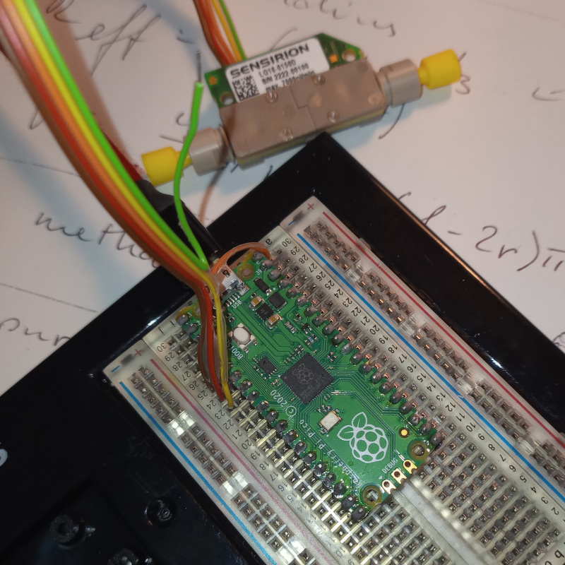

# MOLTECH-FSS Flow Sensor System

*by Matthieu Loumaigne and Martinus Werts*

*MOLTECH-Anjou, CNRS, Université d'Angers*

The MOLTECH-FSS Flow Sensor System enables recording of microfluidic flow rates through capillaries, using USB-connected hardware modules. At the heart of these modules there is a Sensirion liquid flow sensor (LG16-xxxxD family), which is managed by an Arduino-compatible microcontroller communicating with a host terminal (typically, a lab PC) through a USB serial connection.

This section of the repository contains the hardware description of the MOLTECH-FSS and the Arduino firmware. The host terminal software (Python programs running on the lab PC) can be found in `MANBAMM-control/python-src` together with the control software for other lab devices (*e.g.*, syringe pumps, fluidic valves).

## Hardware

Hardware information for the Sensirion modules can be found in the [Sensirion LG16-xxxxD datasheet](https://github.com/mhvwerts/MANBAMM-control/blob/main/MOLTECH-flow-sensor-system/res/Sensirion_Liquid_Flow_Meters_LG16_xxxxD_Datasheet.pdf), of which we keep a copy in this repository.

### Arduino

The Sensirion LG16-xxxxD modules are easily connected to an Arduino board for communication via an I2C bus. Here's the configuration for a standard Arduino UNO board (information provided by Sensirion).

Apparently, it is not necessary to add separate external pull-up resistors to the circuit. The sensor can be connected directly to the Arduino I/O pins.

### Raspberry Pi Pico

Similarly, we succesfully used a readily available [Raspberry Pi Pico microcontroller board]( https://www.raspberrypi.com/documentation/microcontrollers/pico-series.html#pico-1-family). The (Arduino-style) firmware works with the excellent [Arduino-Pico environment](https://arduino-pico.readthedocs.io/en/stable/), which enables direct programming of the Pico board using the Arduino IDE.

Pin connections between Sensirion module and RPi Pico board, using the flat ribbon cable from the connectivity kit. No additional resistors are needed:

- SDA (brown wire) to Pico pin 6 (I2C0 SDA)
- SCL (red wire) to Pico pin 7 (I2C0 SCL)
- GND (yellow wire) to Pico pin 8 (GND)
- V_DD (orange wire) to Pico pin 40 (VBUS)
- Green wire is not connected, left floating as indicated in the datasheet

Check out the [pin-out diagram of the Raspberry Pi Pico](https://github.com/mhvwerts/MANBAMM-control/blob/main/MOLTECH-flow-sensor-system/res/Pico-R3-A4-Pinout.pdf)

### Packaging

It is important to package all the elements into a robust box. Fluidic connections are made with standard (IDEX-style) fittings. The LG16-0150D sensor connects readily to 1/32" (PEEK) capillary tubing. Other models may use 1/16" tubing.

## Firmware

`firmware_flowsensors_vX_X.ino` contains the current Arduino firmware. On one side, it takes care of the I2C communication with the Sensirion SF04 chip in the LG16-xxxxD series sensors. On the other side, it interacts with the host terminal via a (USB) serial connection.

More information and Arduino code for low-level communication with the Sensirion liquid flow sensors can be found at https://github.com/Sensirion/arduino-liquid-flow-snippets

## USB serial communication protocol

The protocol is very simple, and uses ASCII text. Numbers are given in ASCII decimal form. Each text block is terminated with a `!`, both on the terminal side and on the sensor module side.

The sensor module replies to opcodes that are sent from the terminal via USB serial.

| Opcode  | Function                                 |
|---------|------------------------------------------|
| `?!`    | Get the ID/name of the connected sensor module  |
| `I!`    | Get info on the sensor configuration, flow rate units, firmware version |
| `M!`    | Liquid flow rate measurement with calibrated unit conversion  |
| `R!`    | Liquid flow rate measurement returning raw sensor data (signed 16-bit integer |

